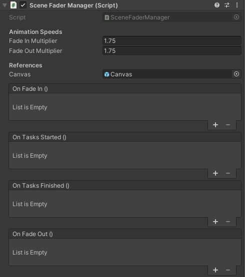

# Scene-Fader-Manager
A scene fader manager that loads in scenes and performs tasks. Comes with an extensive `SceneUtility` class which handles scene management.

## Prerequisites
This package uses the `Singleton` and `StateMachineCallback` packages. It is recommended to install both of these packages before installing this one.

[https://github.com/Jason-Skillman/Unity-Singleton](https://github.com/Jason-Skillman/Unity-Singleton)

[https://github.com/Jason-Skillman/State-Machine-Callback](https://github.com/Jason-Skillman/State-Machine-Callback)

Requires Unity version 2020.1 or greater.

---
**Note:**

Prerequisite packages can also be installed with the same steps below.

---

## How to install
This package can be installed through the Unity `Package Manager` with Unity version 2019.3 or greater.

Open up the package manager `Window/Package Manager` and click on `Add package from git URL...`.

)

Paste in this repository's url.

`https://github.com/Jason-Skillman/Scene-Fader-Manager.git`

)

Click `Add` and the package will be installed in your project.

## How to setup
You can create the manager by going to `Create/Scene Fader/Scene Fader Manager` in the `Hierarchy` window. Only one manager should exist at any given time.

## SceneFaderManager
The manager is is charge of fading in and out the screen while performing tasks and operations.

)

Example 1: This example creates a `IEnumerator` tasks and gives it to the `SceneFaderManager`. While the screen has fade to black the scene will be loaded in.
```C#
//This task will load in Scene01
IEnumerator task1 = SceneUtility.CoroutineLoadScene("Scene01");

//Give the task to SceneFaderManager
SceneFaderManager.Instance.FadeAndPerformTasks(0, task1);
```

Example 2: This example creates two tasks and gives it to the `SceneFaderManager`. Together these tasks load in level 2 and unload level 1.
```C#
//This task will load in all the scenes in sceneArray
IEnumerator task1 = SceneUtility.CoroutineLoadScenesAdditive(sceneArray);
//This task will unload Scene01
IEnumerator task2 = SceneUtility.CoroutineUnloadScene("Scene01");

//Give the task to SceneFaderManager
SceneFaderManager.Instance.FadeAndPerformTasks(0, task1, task2);
```

These are just examples for loading in and out scenes but custom coroutines can be created and given to the `SceneFaderManager`. Ex. Generate a procedural level or spawn in all players.

|Event|Description|
|---|---|
|`OnFadeIn`|Fires when the manager has started fading in.|
|`OnTasksStarted`|Fires when the manager's tasks have just started.|
|`OnTasksFinished`|Fires when all of the tasks are finished and the manager starts fading out.|
|`OnFadeOut`|Fires when the manager has completely faded out and the screen is visible.|

## Components

### Persistent
The `Persistent` component is used for quickly making game objects's persistent. When you are loading in and out scenes you should always have an active camera to show the UI and hear audio. Uses `DontDestroyOnLoad()`.

### SceneUtilityFunctions
The `SceneUtilityFunctions` component is a wraper class that uses the static functions found in the `SceneUtility`. Can be used to instantly load or unload scenes with a UI button or other event.

### SceneFaderFunctions
The `SceneFaderFunctions` component is a wraper class that uses the functions found in the `SceneFaderManager`. Can be used to load or unload scenes using the fader's animation.

## SceneUtility
`SceneUtility` is a static class which houses multible methods to load in and out scenes. `SceneUtility` is a wrapper for Unity's `SceneManager` and adds extra functionality, guard clauses, and performace boosts.

|Property|Description|
|---|---|
|`LogType` `LogLevel`|Sets the utilities's log level.|

#### Static methods
These methods are all static and can be called from anywhere.

|Method|Description|
|---|---|
|`LoadScene()`|Loads a single scene.|
|`LoadScenesAdditive()`|Loads in an array of scenes additively.|
|`LoadActiveScene()`|Loads in the active base scene with an array of additive scenes.|
|`UnloadScene()`|Unloads a single scene.|
|`UnloadScenes()`|Unloads an array of scenes.|
|`UnloadAllScenesExceptFor()`|Unloads all scenes except for the provided array.|

#### Coroutines
These methods perform the same functions as the ones above but can be called from a `MonoBehaviour` and can be used with the `SceneFaderManager`'s task system.

|Method|Description|
|---|---|
|`CoroutineLoadScene()`|Loads a single scene.|
|`CoroutineLoadScenesAdditive()`|Loads in an array of scenes additively.|
|`CoroutineUnloadScene()`|Unloads a single scene.|
|`CoroutineUnloadScenes()`|Unloads an array of scenes.|
|`CoroutineUnloadAllScenesExceptFor()`|Unloads all scenes except for the provided array.|

|Event|Description|
|---|---|
|`Action<string[]>` `OnSceneLoaded`|Fires when a scene has been loaded.|
|`Action<string[]>` `OnSceneUnloaded`|Fires when a scene has been loaded.|
